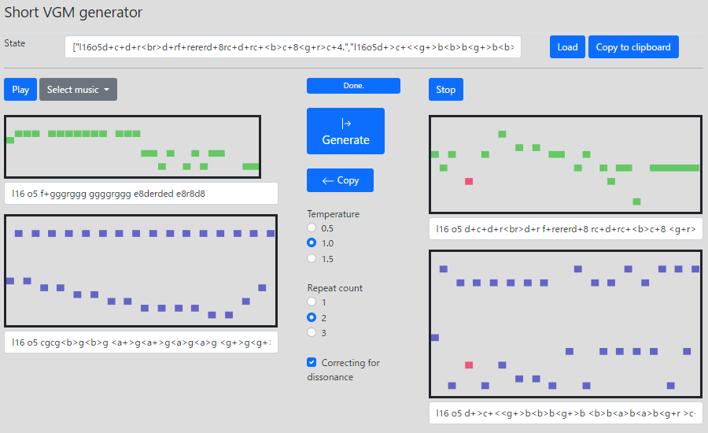

# short-VGM-generator ([DEMO](https://abagames.github.io/short-vgm-generator/build/))

Generate short video game music, automatically, endlessly.

It is powered by machine learning with [magenta.js](https://magenta.tensorflow.org/)

## HOW TO PLAY

Press the 'Generate' button. (For the first time, please wait until the initialization of the model for generation is finished.) It will generate countless pieces of music.

## INSTRUCTIONS

### [Generate]

Generate new music based on the music on the left of the screen. The generated music will be displayed on the right of the screen.

### [Copy]

Copy the generated music and use it as the basis for the next music to be generated.

### [Temperature][repeat count]

The larger the number, the more random the music will be generated.

### [Correcting for dissonance]

Correct dissonance to consonance.

### [Select music]

Select the music that will be the source of the generation.

### [Load]

Load the data for the music in the 'state' text box.

### [Copy to clipboard]

Copy the text that represents the current music information to the clipboard. Paste this text into the 'state' text box and press the 'load' button to load the music.

### [Play][stop]

Play/Stop music. Music is described in [MML (Music Macro Language)](https://github.com/mohayonao/mml-iterator)
